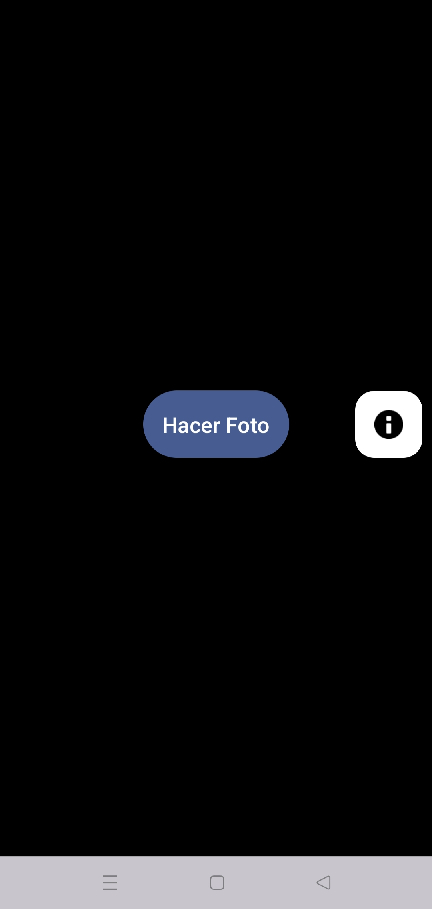
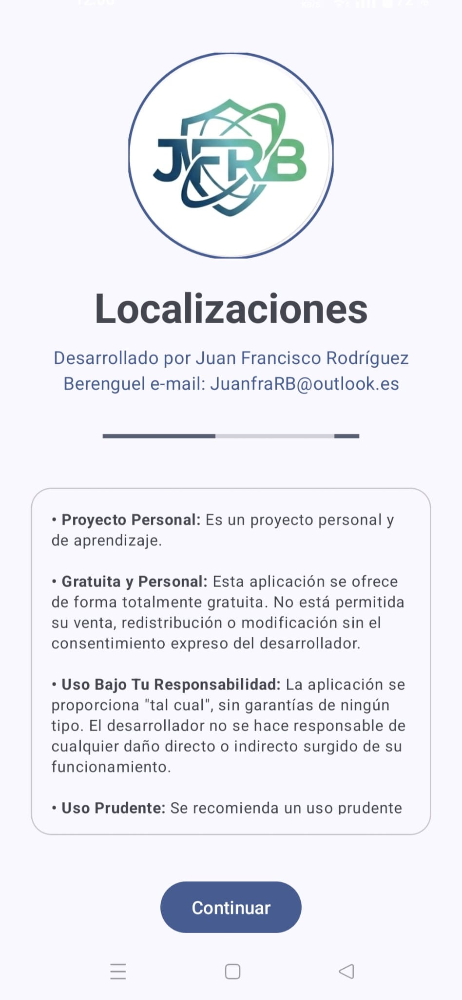
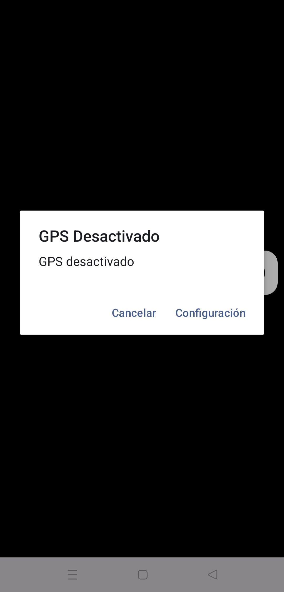

# FotoLocaliza 📍📸

**FotoLocaliza** es una aplicación de Android diseñada para capturar fotografías integrando automáticamente información contextual crítica directamente sobre la imagen. Es ideal para trabajos de campo, auditorías o cualquier actividad que requiera documentar la ubicación exacta y la orientación en el momento de la toma.

## ✨ Características Principales

- **Captura con Geo-etiquetado Visual**: Añade una marca de agua en tiempo real con:
    - Latitud y Longitud precisas.
    - Dirección (Azimut) capturada mediante los sensores del dispositivo.
- **Brújula Integrada**: Utiliza el acelerómetro y el magnetómetro para determinar la orientación exacta.
- **Gestión de Galería Inteligente**: Crea automáticamente una carpeta llamada `GPS_Photos` en la galería del dispositivo para organizar las capturas.
- **Interfaz Moderna**:
    - Pantalla de inicio (Splash Screen).
    - Previsualización antes de guardar.
    - Sección "Acerca de" con animaciones fluidas.
- **Compatibilidad**: Soporta desde Android 8.0 (Oreo) hasta las versiones más recientes, gestionando permisos de forma dinámica.

## 🛠️ Tecnologías Utilizadas

- **Lenguaje**: Java / Kotlin (Gradle KTS).
- **Arquitectura**: MVVM (Model-View-ViewModel) para la lógica de la brújula.
- **Jetpack Components**:
    - `ViewBinding`: Para una interacción segura con las vistas.
    - `ViewModel` & `LiveData`: Gestión del estado de los sensores.
    - `ActivityResultLauncher`: Manejo moderno de permisos y cámara.
- **Google Play Services**: Fused Location Provider para una geolocalización eficiente.
- **Material Design**: Componentes visuales y UX moderna.


## 📸 Capturas de Pantalla

|          Pantalla Inicio           |          Hacer la foto           |             Permiso GPS             |
|:----------------------------------:|:--------------------------------:|:-----------------------------------:|
|   |   |   |


## 📸 Funcionamiento

1. **Permisos**: Al iniciar, la app solicita acceso a la Cámara, Ubicación y Almacenamiento.
2. **Captura**: El usuario pulsa el botón principal para abrir la cámara del sistema.
3. **Procesamiento**: La app obtiene la ubicación GPS y el azimut actual. Procesa la imagen para estampar los datos en la esquina inferior izquierda con un fondo semi-transparente para asegurar la legibilidad.
4. **Guardado**: El usuario puede revisar la foto. Si decide guardarla, se almacena permanentemente en la galería pública.

## 🚀 Instalación y Configuración

1. Clona este repositorio:
```bash
git clone https://github.com/JuanfraRB/FotoLocalizacion.git
```
2. Abre el proyecto en **Android Studio**.
3. Asegúrate de tener configurado el SDK de Android (mínimo API 26).
4. Sincroniza el proyecto con los archivos Gradle.
5. Ejecuta en un dispositivo físico (recomendado para probar los sensores de brújula y GPS).

## 📄 Licencia

Este proyecto es de código abierto. Puedes usarlo y modificarlo según tus necesidades.

---
**Desarrollado por:** [Juan Francisco Rodríguez Berenguel](mailto:JuanfraRB@outlook.es)